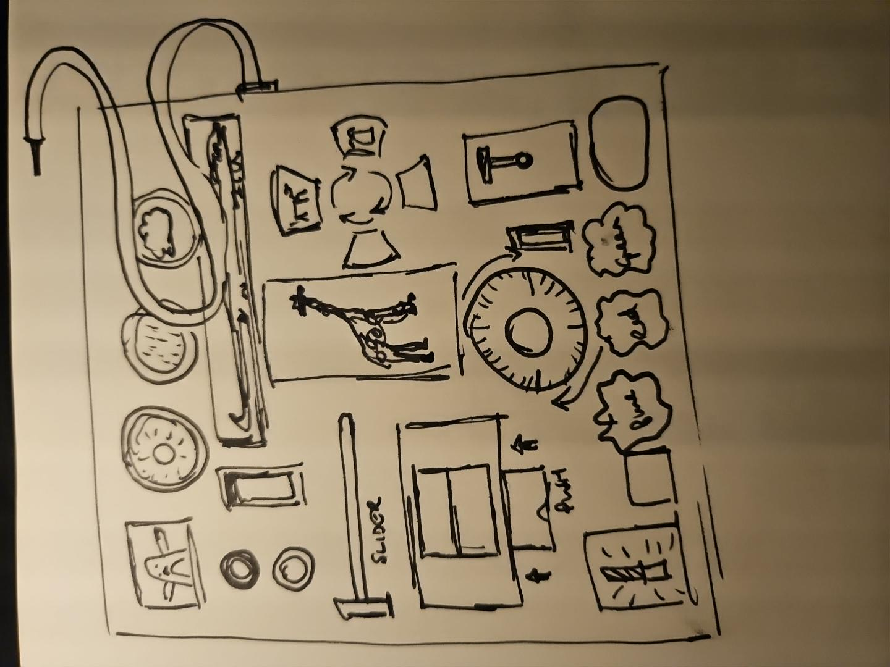

# Digital busy board

Digital busy board for toddlers and parents to have fun, engaging and safe digital experiences.

This prototype is designed for 3-year-olds to explore with a parent or guardian. It's a strange, hand-drawn collection of things to poke, pull, slide, open and discover.

**[Play it in your browser](https://jamesuxer.github.io/Digital-busy-board/)**. It works best on a touchscreen tablet. Sound starts after the first touch.



The prototype is a working version of the sketch above, and it keeps the sketch's black-and-white, homemade look on purpose. Colour only appears as feedback, through weather, lighting, power and the giraffe's disco.

## What this prototype is testing

Version 3 is about the breadth of interaction and about cause and effect, not about visual polish. The question is whether many different kinds of touch can sit together naturally on one board, and whether a child notices that some controls change things elsewhere.

There are no points, levels, rewards, timers or fail states. Nothing tries to keep a child playing.

## The controls

| Thing on the board | Gesture | What happens |
|---|---|---|
| Rocker switch | Toggle | The board goes dark. After a pause, a pair of eyes appears somewhere |
| Penguin | Press | It squawks. It also dresses for the weather: umbrella in rain, puffy jacket and bobble hat in snow, sunshades and a tropical drink in sun |
| Three round buttons | Press | Sun, rain or snow across the whole board. Press again to clear it |
| Cable and plug | Drag into a socket | The top socket gives coloured power, the lower one white light |
| Crocodile | Pull the jaw up, let go | Chomp, chomp, chomp: it snaps shut a few times. It splashes if it's raining |
| Slider | Drag | Lighting changes smoothly from blue to green to another blue |
| Giraffe | Press | Swivels its head from side to side. Dances a tiny disco, with friendly disco music, while coloured power is plugged in |
| Drawer | Pull out, push in | A different silly picture each time |
| Flap | Lift | A worm in a top hat |
| Wheel | Turn or flick | Spins the four-picture cross and changes the disco pattern |
| Pictures on the cross | Press | Dog woofs, cat meows, fish blubs, bird tweets, wherever the wheel has turned them |
| Curtain | Drag sideways | An owl |
| Spring lever | Pull down, let go | Something silly happens somewhere else, on release |
| "blue" blob | Press and hold | A balloon inflates, then deflates when you let go |
| "red" blob | Press | Red paint floods the background. Press again and it drains back into the button |
| "green" blob | Press | A few splats of green paint land around the board, then slowly dry and fade |
| "red" and "green" together | Hold both at once | The whole board hops. Made for two fingers or two people |
| Fogged mirror | Rub | A funny face appears. The fog slowly comes back, and next time it's a different face |
| Ladybird | Drag anywhere | The crocodile watches it, the giraffe giggles, the curtain wiggles, something peeks out of the window |
| Window | (nothing) | Every so often, something passes by on its own |
| Little door | Tap | A mouse |
| DO NOT TOUCH!! button | Press (you know you want to). It's black and white until pressed | Warning beeps and a siren, the board fades out, and everything goes back to how it started |

## Colour shows cause and effect

While you touch a control, it lights up in colour, and so does whatever it changes. Turning the wheel lights up the cross it drives. A weather button lights up the penguin. When the lever's surprise goes off, the giraffe or penguin it affected lights up too. The colour fades shortly after you let go.

## Shared state

Every object reads from four global states: `weather`, `lightOn`, `powerMode` and `backgroundLighting`. Some of the combinations:

- Rain plus a crocodile snap makes a splash.
- Darkness brings eyes, and the window is where they appear first.
- In the dark, coloured power makes the giraffe glow through.
- In the dark, white power dims the darkness to a nightlight.
- Snow puts snow on the frames, a scarf on the penguin and sways the curtain and balloon.
- Sun keeps the mirror clear for longer. Rain fogs it faster.

## Running it

Everything is in one file, `index.html`, with no build step and no dependencies apart from one Google Font. Open it in a browser, or serve the folder:

```bash
python3 -m http.server 8765
```

For review, add `#test` to the URL to expose `__step(n)`, which advances the animation n frames, and `__spawn()`, which sends something past the window.

## Status

This is a working prototype for testing ideas. The sounds are simple synth placeholders and the drawings are deliberately rough. It hasn't been tested with children yet.
